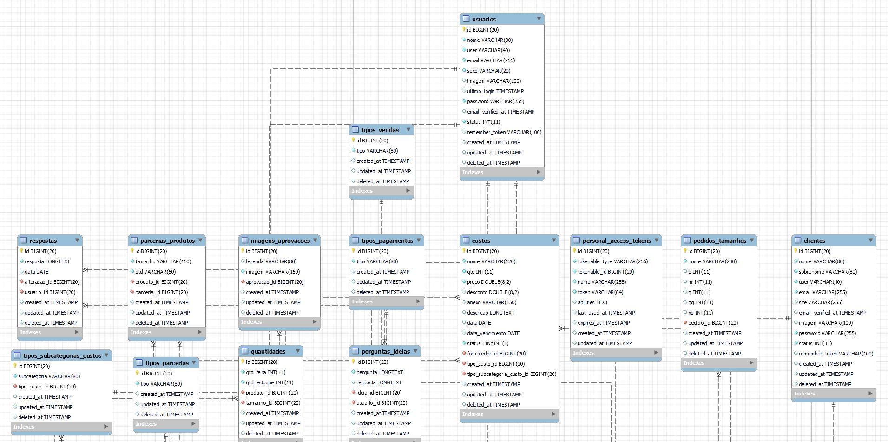
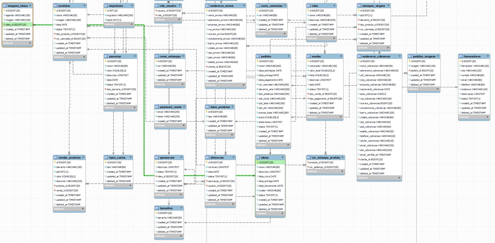

# Sistema de Gerenciamento (CMS) em Laravel 11

## Tabela de Conteúdos

1. [Visão Geral](#visão-geral)
2. [Diagrama BD](#diagrama-bd)
3. [Funcionalidades Principais](#funcionalidades-principais)
4. [Tecnologias Utilizadas](#tecnologias-utilizadas)
5. [Instalação e Execução](#instalação-e-execução)
6. [Contribuições](#contribuições)
7. [Licença](#licença)

## Visão Geral

O Sistema de Gerenciamento é uma plataforma robusta e flexível para administrar e publicar conteúdo dinâmico na web. Construído com base no Laravel, este sistema oferece uma experiência completa de administração para usuários que desejam criar, editar e gerenciar diversos tipos de conteúdo de forma eficiente e intuitiva.

## Diagrama BD




## Funcionalidades Principais

### Gestão de Conteúdo

-   **Criação e Edição de Conteúdo:** Interface intuitiva com editor visual WYSIWYG (What You See Is What You Get).
-   **Organização Hierárquica:** Categorização flexível e tags para estruturar e organizar o conteúdo.
-   **Publicação Agendada:** Recurso para agendar a data e hora de publicação de conteúdo.
-   **Gestão de Mídia:** Upload, armazenamento e otimização de imagens, vídeos e arquivos de mídia.

### Sistema de Login

-  **Login pelo usuario ou email:** Interface para login com email ou usuario e senha.

### Controle de Usuários e Permissões

-   **Autenticação e Segurança:** Sistemas robustos de autenticação e medidas de segurança para proteger dados sensíveis.
-   **Gestão de Permissões:** Controle granular de acesso com diferentes níveis de permissão para usuários.

### Internacionalização e Localização

-   **Suporte a Múltiplos Idiomas:** Capacidade de criar e gerenciar conteúdo em vários idiomas.
-   **Tradução de Conteúdo:** Facilidade para traduzir conteúdo para diferentes idiomas.

## Tecnologias Utilizadas

- **[Laravel Framework](https://laravel.com/):** Base sólida e moderna para desenvolvimento web.
- **MySQL ou Outro Banco de Dados Relacional:** Armazenamento de dados estruturados.
- **Front-end com Blade Templates e [Bootstrap](https://getbootstrap.com/):** Desenvolvimento de interfaces responsivas e visualmente atraentes.
- **Integrações de APIs Externas:** Conexão com serviços externos para funcionalidades específicas.

## Instalação e Execução

### Requisitos

-   PHP 8.2 ou superior
-   Composer
-   Banco de dados Relacional (MySQL, PostgreSQL, etc.)
- [Docker](https://www.docker.com/) e [Docker Compose](https://docs.docker.com/compose/)

### Passos para Instalação

1. Clone este repositório:

    ```bash
    git clone https://github.com/gabriel-americo/sistema-cms-laravel.git sistema-cms-laravel
    ```

    ```bash
    cd sistema-cms-laravel
    ```

2. Suba os containers do projeto:

    ```bash
    docker-compose up -d
    ```

3. Crie o Arquivo .env:

    ```bash
    cp .env.example .env
    ```

4. Acesse o container app:

    ```bash
    docker-compose exec app bash
    ```

5. Instale as dependências do Composer:

    ```bash
    composer install
    ```

6. Configure o arquivo `.env` com as informações do banco de dados:

    ```env
    DB_CONNECTION=mysql
    DB_HOST=seu-host
    DB_PORT=sua-porta
    DB_DATABASE=seu-banco-de-dados
    DB_USERNAME=seu-usuario
    DB_PASSWORD=sua-senha
    ```

7. Gere a key do projeto Laravel:

    ```bash
    php artisan key:generate
    ```

8. Execute as migrações para criar as tabelas no banco de dados:

    ```bash
    php artisan migrate
    ```

9. Cria um link simbólico para o diretório public/storage (Upload de imagens):

    ```bash
    php artisan storage:link
    ```

10. Acesse o projeto:

    ```bash
    http://localhost:8000
    ```

## Contribuições

Contribuições são bem-vindas! Sinta-se à vontade para abrir um PR ou uma issue para melhorias no projeto.

## Licença

Este projeto está licenciado sob a licença MIT.
